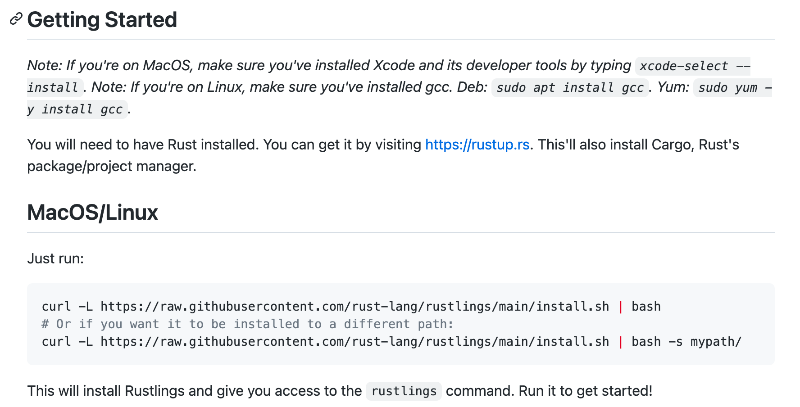
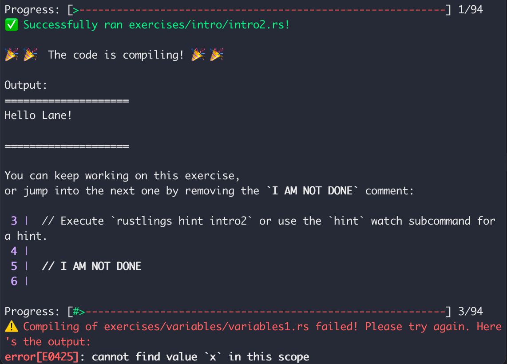
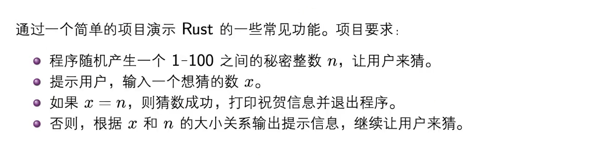

# Rust学习笔记1

## 本地运行环境+Github Classroom

1. 按照[指示](https://github.com/LearningOS/rust-based-os-comp2022/blob/main/scheduling.md) a、b、c步骤创建好基于rustlings加githubclassroom的实验仓库(os2edu版本)

2. 在本地执行`git clone`（建议ssh）

3. `cd` 进实验仓库，按照下需步骤安装rustlings

   

   > ⚠️安装过程中可能遇到如下问题：
   >
   > `curl: (7) Failed to connect to raw.githubusercontent.com port 443: Connection refused`
   >
   > 解决方法指路=>https://github.com/hawtim/hawtim.github.io/issues/10

4. 基于上述步骤，在本地执行`rustlings watch`便可查看要完成的实验和结果是否通过，最后完成一部分实验就可以push到仓库中进行自动评分。

   > 删除//I AM NOT DONE，rustlings watch就会跳转到下一题
   
   
   
   push命令：`git add.` `git commit -m "update"` `git push`
   
   

## Rust语言

### 学习资源

- [清华计算机系大一学生2022暑期课程：Rust程序设计训练](https://lab.cs.tsinghua.edu.cn/rust/)
- [Rust语言圣经(Rust Course)](https://course.rs/about-book.html)
- [rustlings](https://github.com/rust-lang/rustlings)

### 目标

构建可靠且高效的软件

### 特性

- 高效performance：没有运行时和垃圾收集器，代码的运行速度快，内存使用效率高，可用来开发对性能要求高的服务。
- 可靠reliability：用类型系统和所有权模型来确保内存安全性和线程安全性，在编译时消除各种潜在的问题。
- 好用productivity=>多产：有丰富的文档、有好的编译器（提供有用的错误信息)和一流的工具集，包括集成的包管理器和构建工具、支持各种编辑器的代码自动补全和类型查看功能、代码自动格式化工具等

### 使用场景

- 命令行工具
- 网页应用
- 网络服务
- 嵌入式开发

### Rust编写的软件

- Rust语言工具链
- Servo浏览器引擎
- Redox操作系统
- Linux内核正在加入用Rust语言写驱动和模块的支持
- exa、bat、fd等命令行工具
- rCore教学操作系统
- MadFS文件系统

### 初识

```rust
fn main() { //fn => function
	println!("Hello,world!");//输出（! => 宏调用）
}
//c++中#include,#define也是宏
//宏是在编译之前就做了
```

单文件编译运行：

- `rustc hello.rs`
- `./hello`

对于项目：

1. `cargo run`

2. `cargo bulid` + `./hello`

> 项目默认运行的是 `debug` 模式，在这种模式下，**代码的编译速度会非常快**，可是福兮祸所依，**运行速度就慢了**. 原因是，在 `debug` 模式下，Rust 编译器不会做任何的优化，只为了尽快的编译完成，让你的开发流程更加顺畅。
>
> 要性能 => `--release`
>
> https://course.rs/first-try/cargo.html

创建项目：

- `cargo new name`

### 入门小项目



```rust
use std::io;
use rand::Rng;
use std::cmp::Ordering;

fn main() {
    println!("Guess Number Start!");
    let secret_number = rand::thread_rng().gen_range(1..=100);//rng => random number generator
    loop {
        println!("Please input a number:");
        let mut guess = String::new();
        io::stdin().read_line(&mut guess).expect("read line failed");
        let guess: u32 =match guess.trim().parse(){
            Ok(num) => num,
            Err(_) => continue,
        };
        println!("The number you input is {guess}.");
        match guess.cmp(&secret_number){
            Ordering::Less => println!("Too small!"),
            Ordering::Greater => println!("Too big!"),
            Ordering::Equal => {
                println!("You win!");
                break;
            }
        }
    }
}
```

> 依赖一个软件要指定他的版本号的意义？包会更新（虽然最好是能够向后兼容），但是万一没有，新版本中有些旧功能被移除或变化，导致项目依赖出问题而不能运行。

```toml
[dependencies]
rand = "0.8.3"
```

### 基本语法-简

变量绑定 `let`  !=赋值

default => immutable

绑定可以被掩盖shawdowing

常量constants与不可变变量的区别：

- 编译时常数，在编译时可以确定
- 可以出现在任何作用域（包括全局作用域）
- 可以提前使用

Rust中几乎所有东西都是表达式 => 返回一个值作为结果（例外，变量绑定不是expressions）

单位元`()` => 空，可以通过加分号来舍弃表达式的值，返回`()`

数值类型default => i32，f64

字符char => unicode类型，4个字节

isize，usize => `isize` 和 `usize` 类型取决于程序运行的计算机 CPU 类型： 若 CPU 是 32 位的，则这两个类型是 32 位的，同理，若 CPU 是 64 位，那么它们则是 64 位。数组下标索引会用到此类型。

#### 数组

`[T; N]` => T编译时常数，类型/数值；N长度，runtime会检查是否越界

#### 切片

`&[T]`

- 切片表示引用数组中的一部分所形成的视图
- 切片不能直接创建，需要从别的变量借用(borrow)
- 切片可以是可变的，也可以是不可变的

#### 字符串

- Rust两种字符串：String 和 &str

  与C++类比

  String => std :: String

  &str => const char*

- String是在堆上分配空间、可以增长的字符序列

- &str是String的切片类型

- “foo”等字符串字面值都是&str

#### 元祖

- 元祖是固定大小的、有序的、异构的列表类型
- 可以通过下标来访问元祖的分量，eg：foo.0
- 可以使用let绑定来解构

```rust
let foo: (i32, char, f64) = (72, 'H', 5.1);
let (a, b, c) = foo;
```

#### 向量

`Vec<T>`

- Vec是分配在堆上的、可增长的数组

- `<T>`表示泛型，使用时代入实际类型

- 使用`Vec::new()`或`vec!`宏来创建Vec

  `Vec::new()`是名字空间的例子，`new`是定义在Vec结构体中的函数

- 向量可以像数组一样使用[]访问元素

  rust中不能用i32/i64等类型的值作为下标访问元素，必须要使用`usize`类型的值，保证和指针是一样的长度的，其他类型要显示转换成`usize`

```rust
let v0: vec<i32> = Vec::new();

let mut v1 = Vec::new();
v1.push(1);
v1.push(2);
v1.push(3);

let v2 = vec![1,2,3];//与v1等价

let i: i8 = 2;
let y = v2[i as usize];//as 类型转换
```

#### 循环

- while

- loop

  <=> `while(true)` or `for(;;)`，break语句可以返回一个值，作为整个循环的求值结果，只有loop有这个性质

- for

#### 匹配语句

- 匹配语句有一个表达式和一组`value => expression`的分支语句组成（分支都必须是同样类型的值）
- 下划线_用于捕捉所有情况

- 匹配的表达式可以是任意表达式，包括元祖和函数调用
  - 构成模式（patterns）
  - 匹配可以绑定变量，_用来忽略不需要的部分
- 为了通过编译，必须写穷尽的匹配模式
- 可以用if来限制匹配的条件

```rust
let x = 3;
let y = -3;
match (x,y) {
  (1,1) => println!("one"),
  (2,j) => println!("two,{}",j),
  (_,3) => println!("three"),
  (i,j) if i > 5 && j < 0 => println!("On guard!"),
  (_,_) => println!(":<"),
}
```

#### 宏

- 宏看起来很像函数，但是名字以`!`结尾
- 可以做很多有用的事情，宏的原理是在编译时产生代码
- 宏调用的方式看起来和函数类似
- 用户可以自己来定义宏
- 很多常用工具使用宏来实现的

举例：

`print!` 和`println!`

- 用来输出文字信息

- 使用`{}`来做字符串插入，`{:?}`做调试输出

  注：数组和向量，只能用调试输出的方式来打印

- `{}`里可以加数字，表示第几个参数，新版本还可以把变量名写在`{}`里

其余宏：`format!` 、`panic!`、 `assert!`、 `assert_eq!`、 `unreachable!`、 `unimplemented!` ......

