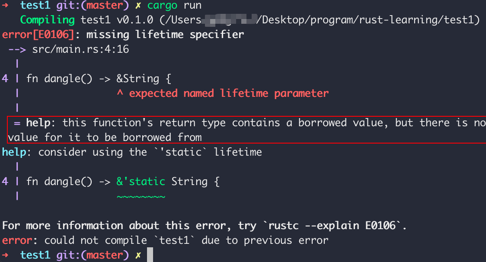

# 基于Rust的内存安全问题探索

参考资料：Rust语言圣经 https://course.rs/about-book.html

Rust的内存安全性处理确实让人眼前一亮，相比于c语言的手动free()、c++的delete()还是java、go中的GC机制，rust的**所有权系统**让一切在编译阶段就check完毕，真是安全开发的福音！

## Dangling Reference

```rust
fn main() {
    let reference_to_nothing = dangle();
}
fn dangle() -> &String {
    let s = String::from("hello");
    &s
}
```

在dangle函数里面创建String对象s，并返回了s的引用。但是⚠️当函数调用完毕后，创建的s对象的生命周期就结束了，换句话说，这个String对象以及存储在堆上的实际资源已经被释放掉了，这时返回s对象的引用给调用者reference_to_nothing，就会出现引用存在，但是指向的内存中数据已经没了➡️典型的内存安全问题，其他语言可能编译就给过了，但是运行过程中会出现问题。

而我们本篇的主角Rust就不会让这样的情况产生。



解决方法-返回对象，转移所有权：

```rust
fn main() {
    let reference_to_nothing = dangle();
}
fn dangle() -> String {
    let s = String::from("hello");
    s
}
```

由此可见Rust为了防止出现这样的内存安全问题，对于借用存在规则：**引用必须总是有效的**。

## Double Free

```rust
fn main(){
	let s1 = String :: from("hello");
  let s2 = s1;
}
```

由于String不是一个基本类型，因此`s2 = s1`的写法并不会像基本类型(存储在栈上)一样进行自动拷贝。由于String类型是由存储在栈上的**(堆指针、字符串长度、字符串容量)**加上存储在堆上的**实际资源**两部分组成，如果`s2 = s1`直接进行深拷贝(可用clone()方法实现)，对性能的影响无疑是很大的。

> 在这里Rust是下了一个定义，究其原因是String类型不具备`Copy`特征，所以要考虑所有权问题。一旦具备`Copy`特征，一个旧的变量在被赋值给其他变量后仍然可用。

那考虑浅拷贝呢？

只拷贝栈上的内容速度、性能自然会提升，但是这会造成一个新的问题，在Rust的所有权系统下，堆上的资源存在了2个所有者。当所有者变量离开了作用域后，Rust会**自动**调用drop()函数清理变量的堆内存空间，不过现在有了两个所有者，当s1和s2都离开作用域时，他们释放相同的内存，造成double free➡️内存安全bug之一，两次释放（相同）内存会导致内存污染，它可能会导致潜在的安全漏洞。

基于此分析，Rust的所有权中有如下一条规则：**一个值只允许有一个所有者**

也就是说，我第一行s1获取了这个String对象的所有权，但是当s1赋予s2后，Rust 认为 s1 不再有效，因此也无需在 s1 离开作用域后 drop 任何东西，这就是把所有权从 s1 **转移**给了 s2，s1 在被赋予 s2 后就马上失效了。

```rust
fn main(){
	let s1 = String :: from("hello");
  let s2 = s1;
  println!("{},{}",s1,s2);
}
```


可以看到在这样的规则体系下，编译过程中我们便可发现问题进行处理“borrow of moved value:`s1`”，s1已被移除，换言之，它所指向的那些实际资源和他已经没有关系了，s1离开作用域时不会去drop堆资源。

所以上述代码在面临String类型这样不具备Copy特征下的绑定确实是浅拷贝，只是Rust又做了所有权的约束。这样的衡量不得不让人感叹Rust考虑之周全，这样的所有权机制避免了开发过程中不易发现的安全问题，其内存安全性让人赞叹！


🙌在贴一下所有权的原则，细品这3句话的美妙！